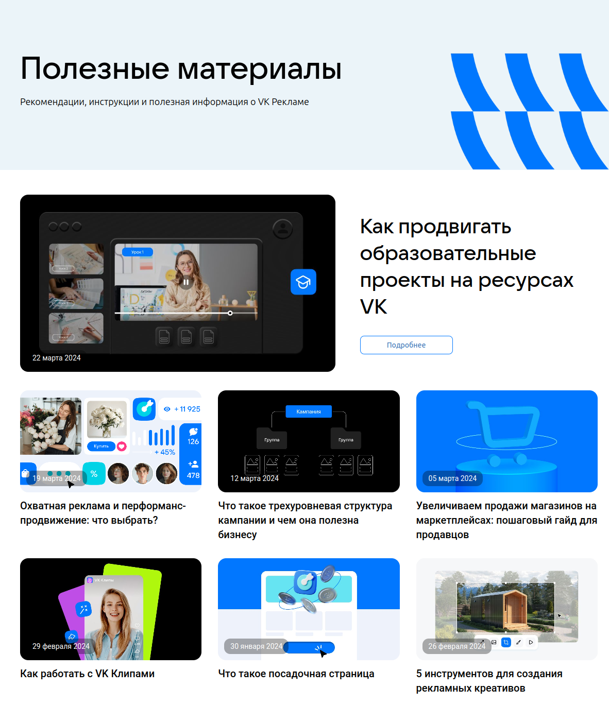
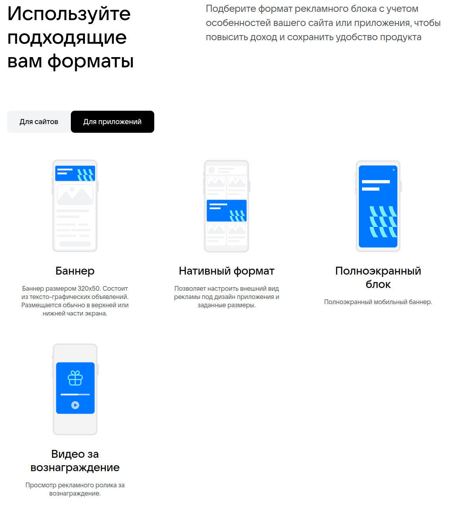
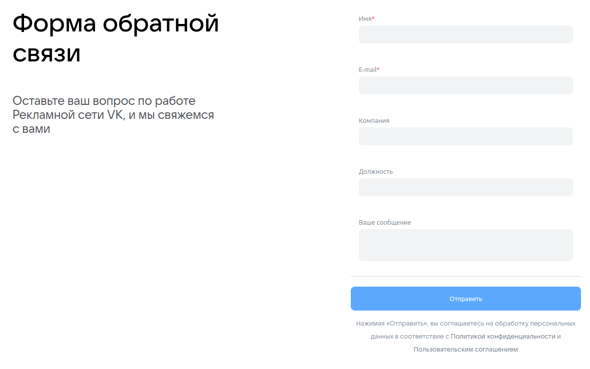

# Чек-листы ads.vk.com

---

Ссылка: https://ads.vk.ru/

* ### При нажатии кнопки `VK Реклама` открывается [главная страница](#1)
* ### При нажатии кнопки `Новости` открывается [страница новостей](#2)
* ### При нажатии кнопки `Обучение(Полезные материалы)` открывается [страница обучения с материалами](#3)
* ### При нажатии кнопки `Обучение(Мероприятия)` открывается [страница обучения с материалами](#4)
* ### При нажатии кнопки `Кейсы` открывается [страница с кейсам](#5)
* ### При нажатии кнопки `Форум идей` открывается [страница форма с идеями](#6)
* ### При нажатии кнопки `Монетизация` открывается [страница с монетизацией](#7)
* ### При нажатии кнопки `? Справка` открывается [страница со справкой о сайте](#8)
* ### При нажатии кнопки `Перейти в кабинет` открывается [страница авториции](#9)

# 1. Главная страница: 
Ссылка: https://ads.vk.ru/

В начале находится карусель с 3 элементами представленными на фото:
||||
|----------------|----------------|----------------|

Далее представлен блок с кейсами компании

При нажатии на кнопку `Смотреть все` открывается [страница кейсов](#4)
При нажатии на любой из кейсов открывается его подробная информация

Далее блок с обучением

При нажатии на кнопку `Подробнее` или на сам блок открывется [страница обучения с мероприятиями](#4)

Далее блок с новостями о сайте

При нажатии на кнопку `Подробнее` или на сам блок открывается [страница новостей](#2)

# 2. Новости 
Ссылка: https://ads.vk.ru/news

Здесь представлен полный список новостей с возможностью перейти на каждую новость и узнать о ней подробнее

# 3. Обучение(Полезные материалы) 
Ссылка: https://ads.vk.ru/insights

Здесь представлен полный список полезных материалов для работы с сайтом с возможностью перейти на каждую и узнать о ней подробнее

Также представлена кнопка `Подробнее`, которая также ведет к более подробному описанию последнего добавленного материала

# 4. Обучение(Мероприятия) 
Ссылка: https://ads.vk.ru/events

Здесь представлен полный список предстоящих мероприятий с возможностью нажать на каждый и узнать подробности

# 5. Кейсы: 

Ссылка: https://ads.vk.ru/cases

Здесь представлен полный список кейсов компании с возможностью нажать на каждый и узнать подробности

# 6. Форум идей: 
Ссылка: https://ads.vk.ru/upvote

Здесь представлен список идей от пользователей сайта при нажатии на которые открывается подробная информация о идее

Далее находится поля для фильтрации идей

* Поисковая строка

* Выпадающий список тем:
  * Лидформы
  * Сообщества
  * Форум идей
  * Сайты
  * Каталог товаров
  * Мобильные приложения
  * Другое

* выпадающий список статусов
  * Голосование
  * Уже в работе
  * Реализована
  * Отклонено

* Если при использовании фильтров результат отсутствует, то повляется заглушка `Не нашлось идей`

# 7. Монетизация: 
Ссылка: https://ads.vk.ru/partner

Здесь представлена более подробная информация о монетизации рекламы

При нажатии любой из 2 кнопок `Перейти в кабинет` открывается [страница авториции](#9)

При нажатии кнопки `Справка` открывается [страница со справкой о сайте](#8)

Далее находится блок демонстрирующий 2 способы работы рекламы

|||
|-----------------|-----------------|

Далее блок вновь предлагающий перейти в личный кабинет, при нажатии кнопки открывается [страница авториции](#9)

После него находится форма обратной связи

При нажатии кнопки `Отправить` без заполнения полей Имя* и E-mail* ничего не просиходит

При нажатии кнопки `Отправить` заполнив поля Имя* и E-mail* будет отрисовано уведомление о принятии формы

# 8. ? Справка: 
Ссылка: https://ads.vk.ru/help

Здесь находятся блоки с руководствами при нажатии на которые можно узнать о них подробнее

Также присутствует поисковая строка

Если ввести некоректную информацию, к примеру несуществующие правило, статистику или просто случайный набор символов и нажать `Enter` отобразится страница заглушка

# 9. Перейти в личный кабинет: 
Ссылка: [VK ID](https://id.vk.ru/auth?app_id=8064163&response_type=silent_token&v=1.61.1&redirect_uri=https%3A%2F%2Fads.vk.ru%2Fapi%2Fcallbacks%2Fvkconnect-complete&uuid=Nc1ArlGuzaSS_J8VuOX9R&redirect_state=%257B%2522redirect_url%2522%253A%2522https%253A%252F%252Fads.vk.ru%252Fhq%253FrequiredAccount%253Dadvert%2522%257D)

# 10. Лид формы и опросы

Ссылка: https://ads.vk.com/hq/leadads/leadforms

При нажатии кнопки `Создать лид форму` появляется выдвигающиеся окно по созданию лид формы

При вводе данных удовлетворяющих условиям, а именно не пустые поля `Название лид-формы`, `Название компание(организации)`, `Заголовок`, `Описание опроса` и загружена фотография в `Логотип` и нажатии конпки `Продолжить`, открывается следующая часть настройки

При нажатии кнопки `Добавить вопрос` открывается окно настройки вопроса

При вводе данных удовлетворяющих условиям, а именно "Вопрос должен быть не пустым и содержать минимум 2 ответа" и нажатии конпки `Продолжить`, открывается следующая часть настройки

При вводе данных удовлетворяющих условиям, а именно не пустые поля `Заголовок` и нажатии конпки `Продолжить`, открывается следующая часть настройки

Если выбрать `Уведомлять о новых заявкахпо email` откроется обезательное поле `Email-адреса для уведомлений (до 10 штук, через запятую)` для заполнения

Если выбрать `Обезательные вопросы`, то откроется окно подтверждения

При вводе данных удовлетворяющих условиям, а именно не пустые поля `Фамилия, имя, отчество(если есть)`, `Адрес регстрации по месту жительства` и нажатии конпки `Сохранить`, открывается главная страница, где уже отображен созданная лид-форма

